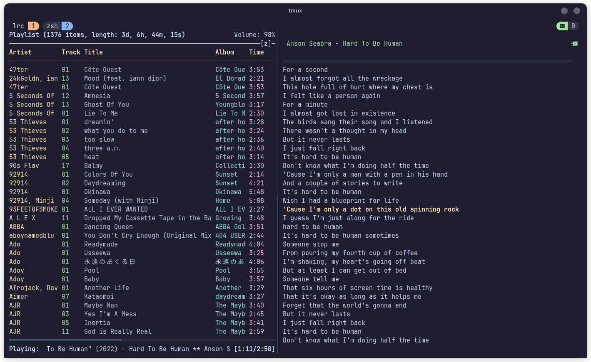

# mpd-lrc



Show mpd current playnig song lyrics

## Usage

**Install**:
```sh
go install github.com/ony-boom/mpd-lrc@latest
```

Just create a the config file `mpdLrc.toml` at your `XDG_HOME_CONFIG` or `~/.config`.
Build, and that's it.

```sh
cp docs/config_example.toml ~/.config/mpdLrc.toml
```
